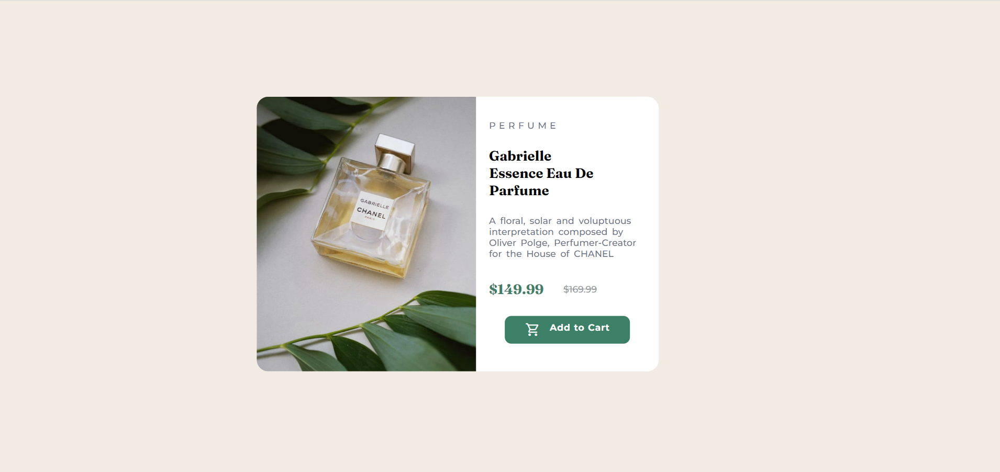
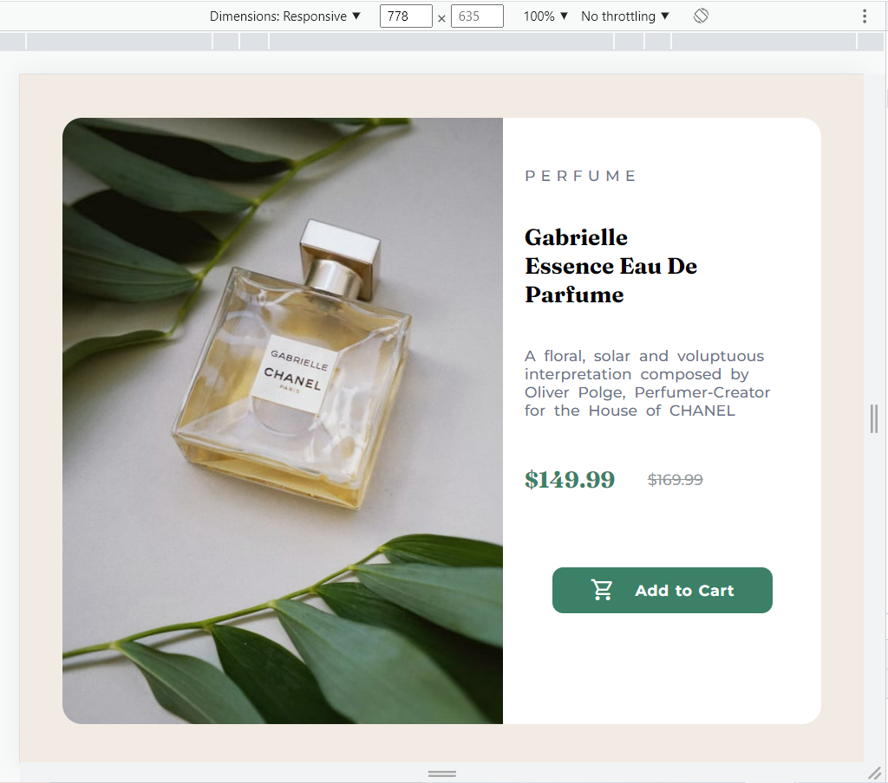
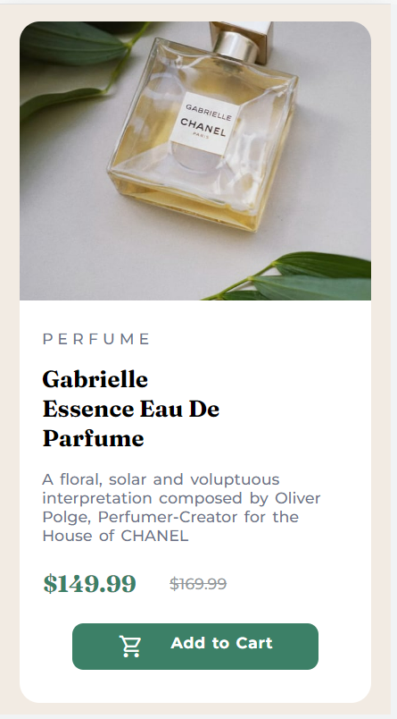

# Frontend Mentor - Product preview card component solution

This is a solution to the [Product preview card component challenge on Frontend Mentor](https://www.frontendmentor.io/challenges/product-preview-card-component-GO7UmttRfa). Frontend Mentor challenges help you improve your coding skills by building realistic projects. 

## Table of contents

- [Overview](#overview)
  - [The challenge](#the-challenge)
  - [Screenshot](#screenshot)
  - [Links](#links)
- [My process](#my-process)
  - [Built with](#built-with)
  - [What I learned](#what-i-learned)
  - [Continued development](#continued-development)
  - [Useful resources](#useful-resources)
- [Author](#author)

**Note: Delete this note and update the table of contents based on what sections you keep.**

## Overview

  ### The challenge

  Users should be able to:

  - View the optimal layout depending on their device's screen size
    - I used mobile : below 375px
              tab/notepad : between 768px and 1440px
              desktop : above 1440px
  - See hover effect for active element "Add to Cart"
  - The layout is designed using "flex box" css

  ### Screenshot

    ##### Desktop screenshot
    <!--  -->
    

    ##### Tab/Notepad screenshot

    

    ##### Mobile screenshot

    

  ### Links

## My process

  ### Built with

  - Tool used - Visual Studio Code
  - Semantic HTML5 markup
  - CSS custom properties
  - Flexbox
  - CSS media for responsive site
  - Desktop-first workflow

  ### What I learned

  - I learned in using "flex box" css and "@media" in building a responsive website. 
  - I faced difficulty in keeping all elements in single component especiall for "ADD TO CART" element.
  - Also learned "position" property in detail while doing this project.
  - Whenever I reduce the size of a web page, "ADD TO CART" element comes out of the "container". Had to position this element to make it optimal for all different style of web pages(mobile,tab,desktop)
  
  ### Continued development

  - In "button section", can add "Add to Favourite - icon" beside "Add to Cart" element for future develpments. 
  - Add a link to "Add to cart" element.

  ### Useful resources

  - [Example resource 1](https://www.w3schools/css.com) - This is an amazing article which helped me finally understand @media query and "flex box". I'd recommend it to anyone who is still learning this concept.

## Author

- Github - [Sravya Veeravalli](https://github.com/Sravya6991)
- Frontend Mentor - [@Sravya6991](https://www.frontendmentor.io/profile/Sravya6991)

